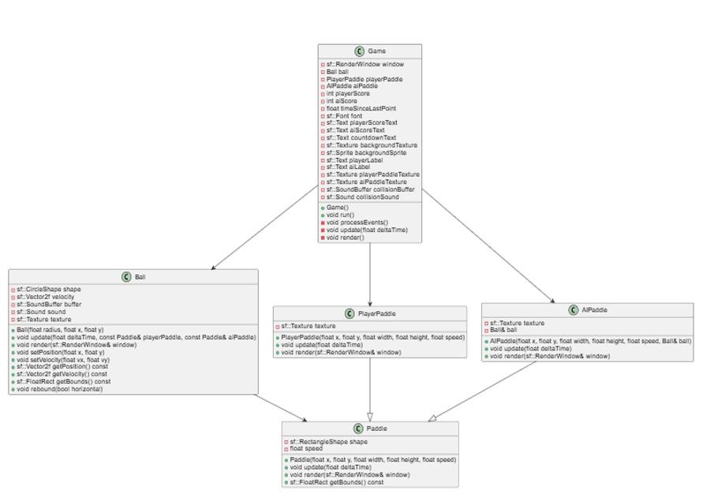

# Pong with AI
En este proyecto se hace una implementación simple del juego de Pong con AI en lenguaje c, utilizando la biblioteca SFML. El juego presenta una partida entre un jugador contra la AI donde la pelota debe de pegar en el lado de uno de los dos para conseguir un punto. Al estar jugando contra una IA, marcar un punto se vuelve una tarea dificil, por lo que si el jugador aguanta 20 segundos sin que la IA le marque un punto a este se le sumará un punto. El juego se acaba cuando alguno de los dos llega a 5 puntos.

# Estructura del Proyecto

Este proyecto esta estructurado de la siguiente manera:

- assets: contiene las imagenes, fuentes de escrirura y sonidos utilizados en el juego.
- bin:  se encuentran los objetos creados por las clases y el ejecutable.
- docs: incluye el diagrama del programa.
- include: se almacenan todos los archivos de las clases que se necesitan para el juego.
- src: se encuentra los codigos que se implementaran a cada clase respectivamente.
- Makefile: es el archivo para compilar y ejecutar el proyecto

# Diagrama de Clases

El diagrama de clases del proyecto incluye las siguientes clases:

# Integrantes:

> Alex Durán de Huerta Jiménez - 23310378

> Byron Zadquiel Flores Gonzalez - 23310338

# Compilacion y Ejecucion del Proyecto

Para poder compilar el proyecto, en la terminal se debe ejecutar el siguiente comando:

> make run

En caso de que no se pueda compilar, ejecutar los siguientes comandos:

> make clean
> make run

# Controles

Para jugar el juego solo se necesitan de las teclas "W" y "A" (subir y bajar el paddle del jugador)

# Capturas de pantalla

